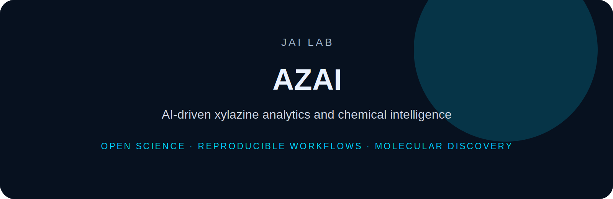

<p align="center">
  
</p>

<h1 align="center">AZAI</h1>

<p align="center">
  <b>AI-driven xylazine analytics and chemical intelligence</b>
</p>

<p align="center">
  
  
  
</p>

---

AZAI is a JAI Lab research program for computational forensic chemistry, analytical workflows, and AI-assisted sensing focused on xylazine and emerging adulterants.

## Focus

- xylazine sensing workflows
- analytical chemistry data
- machine-learning assisted detection
- chemical intelligence for public-health relevant adulterants
- reproducible data pipelines


---

## Installation

```bash
git clone https://github.com/DrJoyKarmakar/AZAI.git
cd AZAI
```

Add project-specific installation instructions here.

---

## Repository standard

This repository follows the **JAI Lab** documentation system:

- clear scientific motivation
- reproducible setup
- documented data/schema assumptions
- benchmark-ready workflows
- citation and licensing information

---

## Citation

```bibtex
@software{jai_lab_azai,
  author = {Karmakar, Joy},
  title = {AZAI},
  year = {2026},
  url = {https://github.com/DrJoyKarmakar/AZAI}
}
```

---

## License

MIT for code unless otherwise specified. Dataset licensing should be defined separately when applicable.
