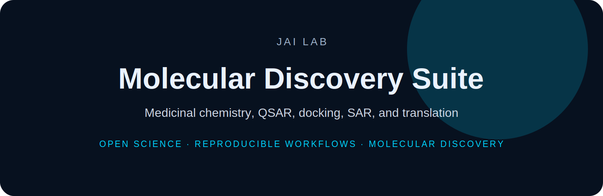

<p align="center">
  
</p>

<h1 align="center">Molecular Discovery Suite</h1>

<p align="center">
  <b>Medicinal chemistry, QSAR, docking, SAR, and translation</b>
</p>

<p align="center">
  
  
  
</p>

---

The Molecular Discovery Suite connects medicinal chemistry, computational modeling, and AI-driven molecular discovery.

## Current target areas

- Pendrin (SLC26A4)
- PAT1 (SLC26A6)
- CFTR
- QSAR modeling
- docking and SAR workflows
- lead optimization


---

## Installation

```bash
git clone https://github.com/DrJoyKarmakar/Molecular-Discovery-Suite.git
cd Molecular-Discovery-Suite
```

Add project-specific installation instructions here.

---

## Repository standard

This repository follows the **JAI Lab** documentation system:

- clear scientific motivation
- reproducible setup
- documented data/schema assumptions
- benchmark-ready workflows
- citation and licensing information

---

## Citation

```bibtex
@software{jai_lab_molecular_discovery_suite,
  author = {Karmakar, Joy},
  title = {Molecular Discovery Suite},
  year = {2026},
  url = {https://github.com/DrJoyKarmakar/Molecular-Discovery-Suite}
}
```

---

## License

MIT for code unless otherwise specified. Dataset licensing should be defined separately when applicable.
