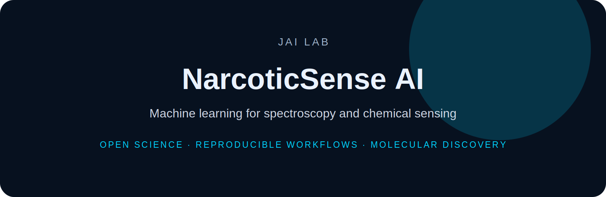

<p align="center">
  
</p>

<h1 align="center">NarcoticSense AI</h1>

<p align="center">
  <b>Machine learning for spectroscopy and chemical sensing</b>
</p>

<p align="center">
  
  
  
</p>

---

NarcoticSense AI explores machine learning, chemometrics, and spectroscopy workflows for analytical chemistry and chemical sensing.

## Focus

- spectroscopy
- chemometrics
- signal processing
- chemical sensing
- reproducible ML workflows


---

## Installation

```bash
git clone https://github.com/DrJoyKarmakar/NarcoticSense-AI.git
cd NarcoticSense-AI
```

Add project-specific installation instructions here.

---

## Repository standard

This repository follows the **JAI Lab** documentation system:

- clear scientific motivation
- reproducible setup
- documented data/schema assumptions
- benchmark-ready workflows
- citation and licensing information

---

## Citation

```bibtex
@software{jai_lab_narcoticsense_ai,
  author = {Karmakar, Joy},
  title = {NarcoticSense AI},
  year = {2026},
  url = {https://github.com/DrJoyKarmakar/NarcoticSense-AI}
}
```

---

## License

MIT for code unless otherwise specified. Dataset licensing should be defined separately when applicable.
