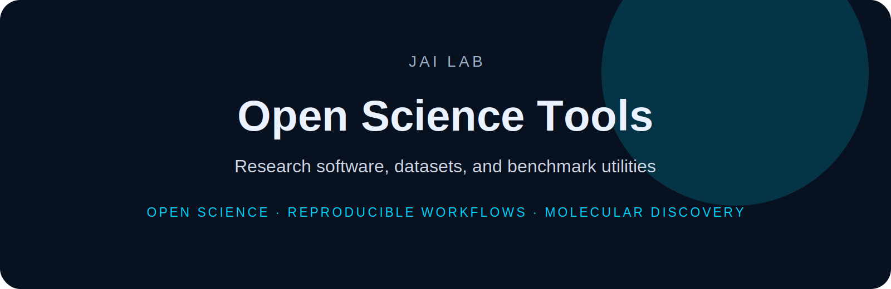

<p align="center">
  
</p>

<h1 align="center">Open Science Tools</h1>

<p align="center">
  <b>Research software, datasets, and benchmark utilities</b>
</p>

<p align="center">
  
  
  
</p>

---

Open Science Tools contains reusable research infrastructure for JAI Lab projects, including databases, paper organization tools, dataset templates, and benchmark utilities.

## Projects

- BimaneDB
- Paper Organizer
- benchmark templates
- reusable documentation standards


---

## Installation

```bash
git clone https://github.com/DrJoyKarmakar/Open-Science-Tools.git
cd Open-Science-Tools
```

Add project-specific installation instructions here.

---

## Repository standard

This repository follows the **JAI Lab** documentation system:

- clear scientific motivation
- reproducible setup
- documented data/schema assumptions
- benchmark-ready workflows
- citation and licensing information

---

## Citation

```bibtex
@software{jai_lab_open_science_tools,
  author = {Karmakar, Joy},
  title = {Open Science Tools},
  year = {2026},
  url = {https://github.com/DrJoyKarmakar/Open-Science-Tools}
}
```

---

## License

MIT for code unless otherwise specified. Dataset licensing should be defined separately when applicable.
