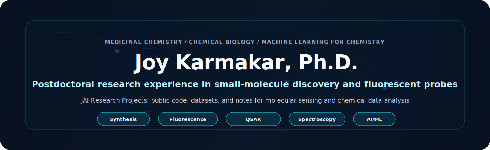
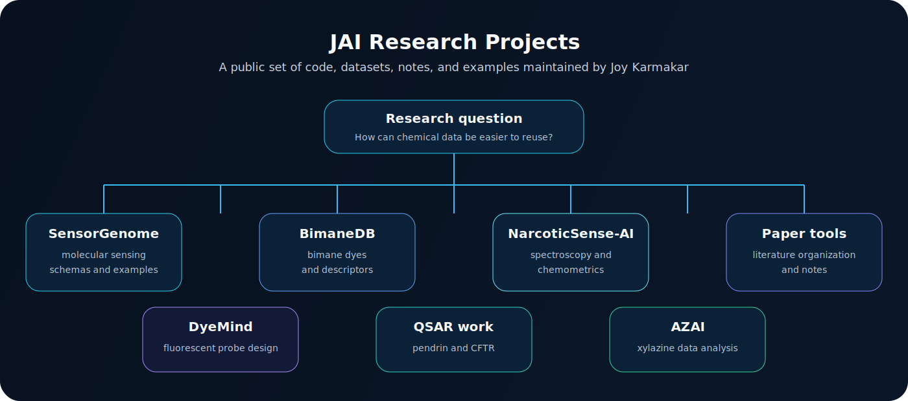
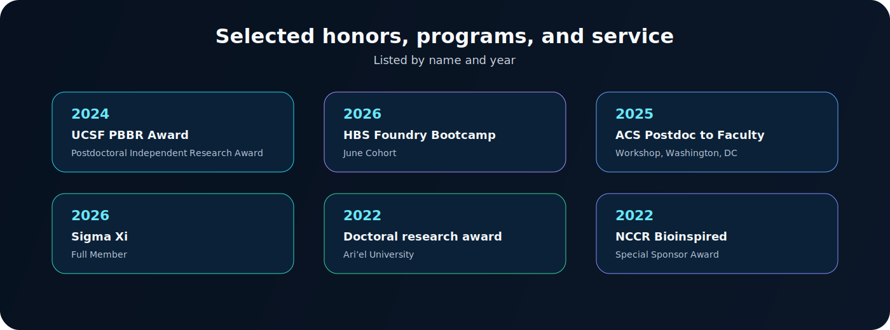
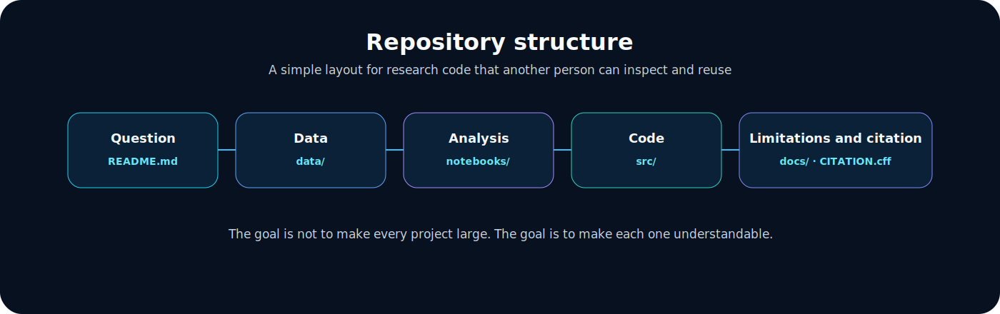

# Joy Karmakar, Ph.D.

**Medicinal chemistry · chemical biology · fluorescent probes · transporter biology · molecular modeling · AI/ML for chemistry**

---

## Profile

I am a medicinal chemist with postdoctoral research experience in the School of Medicine at the University of California, San Francisco. My work has focused on small-molecule modulators of ion transporters, bimane-based fluorescent probes, and the use of computational methods to organize and screen chemical data.

My GitHub is a place for research code, small curated datasets, analysis notebooks, and documentation for projects that can be shared publicly. I am interested in the practical question of how chemical experiments can be recorded in a way that is easier for other researchers, and for computational tools, to reuse.

---

## JAI Research Projects

**JAI Research Projects** is the name I use for a set of public research projects that connect synthetic chemistry, molecular sensing, spectroscopy, cheminformatics, and machine learning.

It is not a formal organization. It is a public workspace for code, data notes, and research tools that I maintain as part of my scientific work.

---

## Current public projects

| Project | Scope | Current status |
|---|---|---|
| [SensorGenome](https://github.com/drjoykarmakar/SensorGenome) | Data schemas, benchmark ideas, and examples for molecular sensing experiments | Ongoing |
| DyeMind | Notes and code for AI-assisted fluorescent probe and fluorophore design | Ongoing |
| [BimaneDB](https://github.com/drjoykarmakar/BimaneDB) | Curated bimane dye table with descriptors and preliminary QSAR analysis | Public repository |
| [NarcoticSense-AI](https://github.com/drjoykarmakar/NarcoticSense-AI) | Spectroscopy preprocessing, chemometrics, and machine-learning classification for analytical chemistry research | Public repository |
| [AZAI](https://github.com/drjoykarmakar/AZAI) | Xylazine-related molecular and spectral data analysis | Ongoing |
| [pendrin-qsar](https://github.com/drjoykarmakar/pendrin-qsar) | RDKit-based QSAR workflow for pendrin inhibitor datasets | Public repository |
| [pendrin-hybrid](https://github.com/drjoykarmakar/pendrin-hybrid) | Combined ligand-based and structure-based modeling workflow for pendrin inhibitors | Public repository |
| [cftr-qsar](https://github.com/drjoykarmakar/cftr-qsar) | QSAR notebooks for CFTR potentiator datasets | Public repository |
| [Paper-Organizer](https://github.com/drjoykarmakar/Paper-Organizer) | Local-first tool for organizing scientific PDFs and notes | Public repository |

---

## Research areas

| Area | What I have worked on |
|---|---|
| Ion transporter chemical biology | Pendrin, PAT1/SLC26A6, and CFTR-related small-molecule work |
| Medicinal chemistry | SAR, lead optimization, small-molecule synthesis, and biological testing through collaborations |
| Fluorescent probes | Bimane derivatives, water sensing, iodine sensing, pH-sensitive probes, and related optical tools |
| Molecular modeling | Docking, QSAR, descriptors, ADMET estimation, and data analysis for small molecules |
| Scientific software | Reproducible notebooks, dataset notes, benchmark templates, and research documentation |

---

## Selected honors, programs, and service

| Year | Item |
|---:|---|
| 2026 | Harvard Business School Foundry Bootcamp, June Cohort |
| 2026 | Full Member, Sigma Xi, The Scientific Research Honor Society |
| 2025 | ACS Postdoc to Faculty Workshop, Washington, DC |
| 2024 | The PBBR Postdoctoral Independent Research Award, Sandler Program for Breakthrough Biomedical Research, UCSF; project: “Selective Fluorescent Sensor for Xylazine” |
| 2024-2025 | Invited Youth Editorial Board Member, *Carbon Energy*, Wiley |
| 2022 | Excellence in Doctoral Research Award, School of Graduate Studies, Ari’el University |
| 2022 | Special Sponsor Award, NCCR Bioinspired / Swiss Academy of Sciences, European Young Chemists Meeting, Fribourg, Switzerland |

---

## Selected publications

1. Master, R.; **Karmakar, J.**; Haggie, P. M.; Anthony-Tan, J.; Chu, T.; Verkman, A. S.; Anderson, M. O.; Cil, O. “High potency 3-carboxy-2-methylbenzofuran pendrin inhibitors as novel diuretics.” *European Journal of Medicinal Chemistry* **2024**, 283, 117133. DOI: [10.1016/j.ejmech.2024.117133](https://doi.org/10.1016/j.ejmech.2024.117133)

2. Chu, T.; **Karmakar, J.**; Haggie, P. M.; Tan, J. A.; Master, R.; Ramaswamy, K.; Verkman, A. S.; Anderson, M. O.; Cil, O. “Selective isoxazolopyrimidine PAT1 (SLC26A6) inhibitors for therapy of intestinal disorders.” *RSC Medicinal Chemistry* **2023**, 14, 2342-2347. DOI: [10.1039/D3MD00302G](https://doi.org/10.1039/D3MD00302G)

3. **Karmakar, J.**; Pramanik, A.; Joseph, V.; Grynszpan, F.; Levine, M. “A dipodal bimane-ditriazole-diCu(II) complex serves as ultrasensitive water sensor.” *Chemical Communications* **2022**, 58, 2690-2693. DOI: [10.1039/D1CC07138F](https://doi.org/10.1039/D1CC07138F)

4. Pramanik, A.; **Karmakar, J.**; Grynszpan, F.; Levine, M. “Highly sensitive water detection through reversible fluorescence changes in a syn-bimane based boronic acid derivative.” *Frontiers in Chemistry* **2022**, 9, 782481. DOI: [10.3389/fchem.2021.782481](https://doi.org/10.3389/fchem.2021.782481)

Full and current publication metrics are best checked on [Google Scholar](https://scholar.google.com/citations?user=uaIKU0oAAAAJ).

---

## Technical skills

**Chemistry:** multi-step organic synthesis, SAR, fluorescent probe design, HPLC, LC-MS, HRMS, NMR, UV-Vis, fluorescence spectroscopy  
**Computational chemistry:** RDKit, AutoDock, AutoDock Vina, Maestro, SwissADME, ADMETlab 2.0, ORCA, Avogadro  
**Data and machine learning:** Python, pandas, NumPy, scikit-learn, PyTorch, TensorFlow, QSAR, molecular descriptors, model evaluation  
**Research documentation:** GitHub, reproducible notebooks, dataset notes, benchmark notes, citation files, project documentation

---

## How I organize repositories

I try to make each repository answer five questions:

1. What scientific question is being addressed?
2. What data are used, and where did they come from?
3. What assumptions or limitations should be known before reuse?
4. How can another researcher reproduce the main analysis?
5. How should the work be cited or adapted?

---

## Current direction

I am continuing to connect experimental chemistry with small, reproducible computational workflows: molecular sensing data, fluorescent probe design, transporter-focused QSAR, and literature tools for chemical biology.

