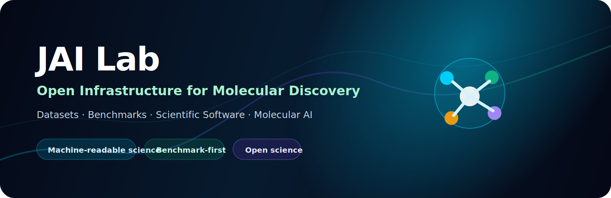
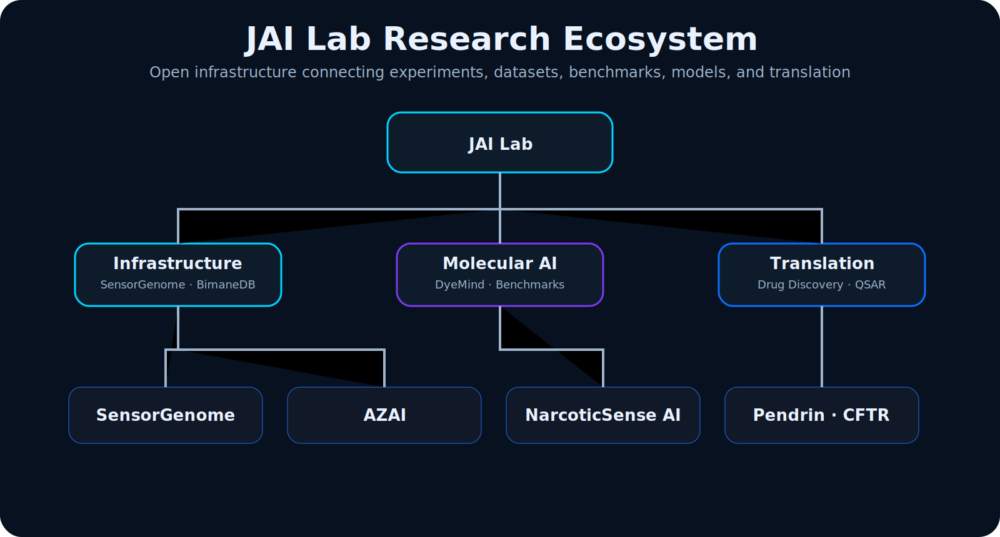

  

<h1 align="center">JAI Lab</h1>

<h3 align="center">Building Open Infrastructure for Molecular Discovery</h3>

  <b>An open research initiative founded by Dr. Joy Karmakar</b>

  
  
  
  

  

---

## Mission

JAI Lab builds open datasets, benchmarks, scientific software, and AI systems for molecular discovery.

The initiative connects synthetic chemistry, chemical biology, fluorescent probes, medicinal chemistry, analytical chemistry, machine learning, and open science.

The goal is to make molecular discovery more reproducible, machine-readable, and useful.

---

## Why this exists

Most AI chemistry projects optimize molecules.

JAI Lab focuses on the infrastructure that makes better discovery possible:

- standardized experimental data
- benchmark-ready datasets
- reproducible software
- active-learning workflows
- uncertainty-aware models
- open scientific documentation
- practical translation into sensing, chemistry, and drug discovery

> The future of molecular discovery will be built not only by better algorithms, but by better scientific infrastructure.

---

## Research Ecosystem

  

---

## Research Programs

<table>
<tr>
<td width="50%">

### 🧬 SensorGenome  
**Open foundation for AI-driven molecular sensing**

Datasets, schemas, benchmarks, uncertainty-aware ML, and active-learning workflows for molecular sensing experiments.

</td>
<td width="50%">

### 🌈 DyeMind  
**AI for fluorescent probe discovery**

Generative and predictive models for fluorophore and fluorescent probe design.

</td>
</tr>
<tr>
<td width="50%">

### 🤖 AZAI  
**AI-driven xylazine analytics**

Computational forensic chemistry and sensor workflows for xylazine and emerging adulterants.

</td>
<td width="50%">

### 🔬 NarcoticSense AI  
**Chemical intelligence through spectroscopy**

Machine learning, chemometrics, and spectroscopy tools for analytical chemistry.

</td>
</tr>
<tr>
<td width="50%">

### 💊 Molecular Discovery Suite  
**Medicinal chemistry + AI**

QSAR, docking, SAR, and lead-optimization workflows for transporter biology including Pendrin, PAT1, and CFTR.

</td>
<td width="50%">

### 📚 Open Science Tools  
**Research infrastructure**

BimaneDB, Paper Organizer, benchmark templates, and reusable documentation systems.

</td>
</tr>
</table>

---

## Scientific foundation

Dr. Joy Karmakar's research spans:

- synthetic organic chemistry
- medicinal chemistry
- fluorescent probe development
- chemical biology
- transporter biology
- molecular docking
- QSAR and AI/ML-guided molecular design
- open-source scientific software

Key research areas include ion transporter chemical biology, small-molecule drug discovery, fluorescent sensors, and AI/ML-guided molecular discovery.

---

## Selected research impact

<table>
<tr>
<td width="50%">

### 🏆 Awards & programs

- UCSF PBBR Postdoctoral Independent Research Award
- ACS Postdoc to Faculty Workshop
- Harvard Business School Foundry Bootcamp
- Sigma Xi Full Member
- Excellence in Doctoral Research Award

</td>
<td width="50%">

### 📚 Publication areas

- European Journal of Medicinal Chemistry
- RSC Medicinal Chemistry
- Chemical Communications
- Frontiers in Chemistry
- Synlett
- Israel Journal of Chemistry
- Inorganica Chimica Acta

</td>
</tr>
</table>

---

## Research principles

| Principle | Meaning |
|---|---|
| Open Science | Useful tools should be reusable and accessible. |
| Benchmark-first Research | Progress should be measurable. |
| Data-centric AI | Better experimental data matters as much as better models. |
| Machine-readable Experiments | Protocols, conditions, uncertainty, and outcomes belong in the dataset. |
| Experimental Validation | Models should connect back to real chemistry. |
| Translation | Software should help researchers build useful molecules, sensors, and therapies. |

---

## Technical capabilities

  

**Chemistry & molecular science:** RDKit, ChemDraw, AutoDock, AutoDock Vina, Maestro, SwissADME, ADMETlab, ORCA, Avogadro, spectroscopy, fluorescence, HPLC, LC-MS, NMR.

---

## GitHub dashboard

  
  

  

  

  

---

## Founder

**Dr. Joy Karmakar**  
Founder, **JAI Lab**

Medicinal chemist working at the intersection of synthetic chemistry, chemical biology, fluorescent probes, drug discovery, and molecular AI.

---

  

