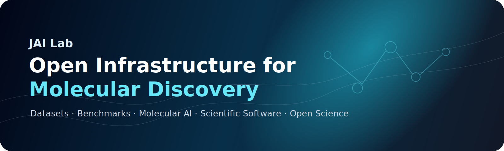
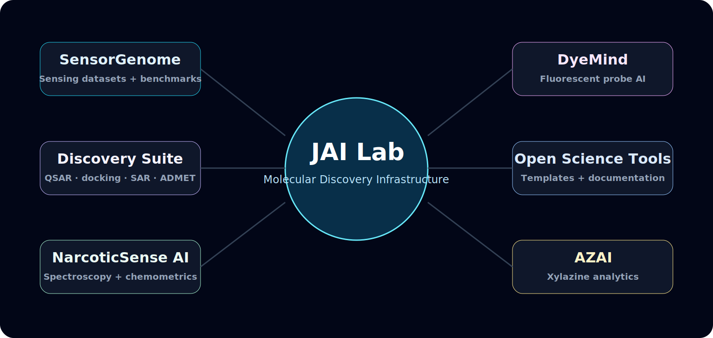
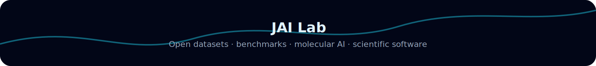

# Joy Karmakar, Ph.D.

### Medicinal chemist building open infrastructure for AI-powered molecular discovery.

**Synthetic chemistry · chemical biology · fluorescent probes · drug discovery · molecular AI · spectroscopy · open science**

---

## What I am building

I am building **JAI Lab**: an open research ecosystem for molecular discovery.

The goal is simple:

> Make molecular discovery as reproducible, programmable, benchmarkable, and collaborative as modern software development.

JAI Lab focuses on the scientific infrastructure behind better molecular AI: datasets, schemas, benchmarks, predictive models, active-learning workflows, chemoinformatics tools, spectroscopy pipelines, and open documentation.

---

## Research thesis

Most AI chemistry projects optimize molecules.  
I focus on the infrastructure that makes trustworthy molecular discovery possible.

<table>
<tr>
<td width="33%"><b>Better data</b> Standardized, machine-readable experimental records.</td>
<td width="33%"><b>Better benchmarks</b> Tasks that make progress measurable and reproducible.</td>
<td width="33%"><b>Better tools</b> Open software that connects models back to real chemistry.</td>
</tr>
</table>

---

## JAI Lab ecosystem

| Program | Focus | Status |
|---|---|---|
| **SensorGenome** | Open datasets, schemas, benchmarks, and active learning for molecular sensing | Flagship |
| **DyeMind** | AI-assisted fluorescent probe and fluorophore discovery | Flagship |
| **NarcoticSense AI** | Spectroscopy, chemometrics, and ML for analytical chemistry | Active |
| **AZAI** | AI-driven xylazine analytics and forensic chemistry workflows | Active |
| **Molecular Discovery Suite** | QSAR, docking, SAR, and ADMET workflows for transporter biology | Active |
| **Open Science Tools** | Research paper organization, dataset cards, benchmark templates, and reproducible documentation | Active |

---

## Featured repositories

<table>
<tr>
<td width="50%">

### 🧬 SensorGenome
Open platform for molecular sensing datasets, benchmark tasks, active learning, and autonomous sensor discovery.

**Use it for:** molecular sensing datasets, AI-ready experimental schemas, benchmark-first sensor discovery.

</td>
<td width="50%">

### 🔬 NarcoticSense AI
Open-source AI platform for spectroscopy, chemometrics, and machine learning in analytical chemistry and narcotic sensing research.

**Use it for:** spectra preprocessing, chemometric analysis, classification, and interpretable sensing workflows.

</td>
</tr>
<tr>
<td width="50%">

### 🤖 AZAI
AI-driven xylazine analytics and innovation for emerging adulterant detection and forensic chemistry.

**Use it for:** xylazine-focused analytics, data workflows, and molecular intelligence.

</td>
<td width="50%">

### 💊 Pendrin modeling suite
Structure-based and ligand-based modeling of pendrin inhibitors, including QSAR and hybrid workflows.

**Use it for:** transporter-focused medicinal chemistry, docking, QSAR, and lead optimization.

</td>
</tr>
<tr>
<td width="50%">

### 📚 Paper Organizer
AI-powered research paper organizer for researchers using Google Drive and Zotero-oriented workflows.

**Use it for:** literature triage, research memory, and scientific knowledge organization.

</td>
<td width="50%">

### 🌈 DyeMind
AI for fluorescent probe discovery and fluorophore design.

**Use it for:** future foundation models and predictive tools for probe chemistry.

</td>
</tr>
</table>

---

## Scientific foundation

My work sits at the intersection of experimental chemistry and computational discovery.

| Area | Capabilities |
|---|---|
| **Synthetic and medicinal chemistry** | small-molecule design, SAR, lead optimization, transporter biology |
| **Fluorescent probes and sensing** | probe design, molecular recognition, spectroscopy, analytical methods |
| **Chemical biology** | ion transporters, biological validation, mechanistic interpretation |
| **Molecular AI** | QSAR, molecular descriptors, generative ideas, active learning, uncertainty-aware prediction |
| **Cheminformatics** | RDKit, fingerprints, molecular datasets, structure-property analysis |
| **Open science infrastructure** | dataset cards, benchmark cards, reproducible workflows, transparent documentation |

---

## Technical stack

**Chemistry and molecular science:** RDKit · ChemDraw · AutoDock · AutoDock Vina · Maestro · SwissADME · ADMETlab · ORCA · Avogadro · HPLC · LC-MS · NMR · fluorescence spectroscopy  
**AI and data:** Python · PyTorch · TensorFlow · scikit-learn · pandas · NumPy · QSAR · molecular descriptors · active learning · uncertainty estimation  
**Research infrastructure:** GitHub Actions · Docker · reproducible notebooks · dataset cards · benchmark documentation · open-source workflows

---

## Research principles

| Principle | Commitment |
|---|---|
| **Open science** | Tools, datasets, and documentation should be reusable and inspectable. |
| **Benchmark-first research** | Progress should be measurable, not just visually impressive. |
| **Data-centric AI** | Better experimental data is as important as better algorithms. |
| **Machine-readable chemistry** | Conditions, protocols, uncertainty, and outcomes belong in structured data. |
| **Experimental grounding** | Models should connect back to real molecules and real measurements. |
| **Translation** | Software should help scientists build useful sensors, molecules, and therapies. |

---

## Current roadmap

- [ ] Release polished SensorGenome schema and dataset-card standard
- [ ] Create benchmark cards for molecular sensing tasks
- [ ] Build active-learning examples for sensor discovery
- [ ] Standardize repository documentation across JAI Lab projects
- [ ] Publish reproducible notebooks for QSAR, docking, spectroscopy, and sensing workflows
- [ ] Expand DyeMind into a full fluorescent-probe AI workspace
- [ ] Add public documentation site for JAI Lab projects

---

## GitHub activity

---

## Collaboration

I am interested in collaborations across:

- molecular sensing and fluorescent probes
- medicinal chemistry and transporter biology
- spectroscopy and analytical chemistry
- AI/ML for chemistry and drug discovery
- open datasets, benchmarks, and scientific software
- reproducible research infrastructure

For research, collaboration, or open-source work, connect through [joykarmakar.com](https://www.joykarmakar.com), [LinkedIn](https://www.linkedin.com/in/joykarmakarchem), or GitHub.

---

### Building open infrastructure for molecular discovery.

