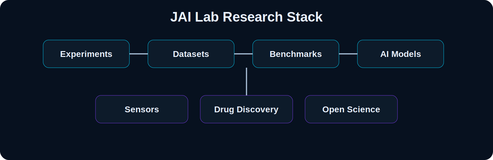

  

<h1 align="center">JAI Lab</h1>

<h3 align="center">Building Open Infrastructure for Molecular Discovery</h3>

  <b>An open research initiative founded by Dr. Joy Karmakar</b>

  
  
  
  

---

## Mission

JAI Lab builds open datasets, benchmarks, scientific software, and AI systems for molecular discovery.

We work across:

- molecular sensing
- fluorescent probe discovery
- analytical and forensic chemistry
- medicinal chemistry
- drug discovery
- open scientific infrastructure

The goal is simple: make molecular discovery more reproducible, machine-readable, and useful.

---

## Research Programs

<table>
<tr>
<td width="50%">

### 🧬 SensorGenome  
**Open foundation for AI-driven molecular sensing**

Datasets, schemas, benchmarks, uncertainty-aware ML, and active-learning workflows for molecular sensing experiments.

</td>
<td width="50%">

### 🌈 DyeMind  
**AI for fluorescent probe discovery**

Generative and predictive models for fluorophore and fluorescent probe design.

</td>
</tr>
<tr>
<td width="50%">

### 🤖 AZAI  
**AI-driven xylazine analytics**

Computational forensic chemistry and sensor workflows for xylazine and emerging adulterants.

</td>
<td width="50%">

### 🔬 NarcoticSense AI  
**Chemical intelligence through spectroscopy**

Machine learning, chemometrics, and spectroscopy tools for analytical chemistry.

</td>
</tr>
<tr>
<td width="50%">

### 💊 Molecular Discovery Suite  
**Medicinal chemistry + AI**

QSAR, docking, SAR, and lead-optimization workflows for transporter biology including Pendrin, PAT1, and CFTR.

</td>
<td width="50%">

### 📚 Open Science Tools  
**Research infrastructure**

BimaneDB, Paper Organizer, benchmark templates, and reusable documentation systems.

</td>
</tr>
</table>

---

## Research Stack

  

---

## Principles

1. **Open science** — useful tools should be reusable.
2. **Benchmark-first research** — progress should be measurable.
3. **Data-centric AI** — better experimental data matters as much as better models.
4. **Machine-readable experiments** — protocols, conditions, uncertainty, and outcomes belong in the dataset.
5. **Experimental validation** — models should connect back to real chemistry.
6. **Translation** — software should help researchers build useful molecules, sensors, and therapies.

---

## Founder

**Dr. Joy Karmakar** is a medicinal chemist working at the intersection of synthetic chemistry, chemical biology, fluorescent probes, drug discovery, and molecular AI.

---

## Closing

> The future of molecular discovery will be built not only by better algorithms, but by better scientific infrastructure.
