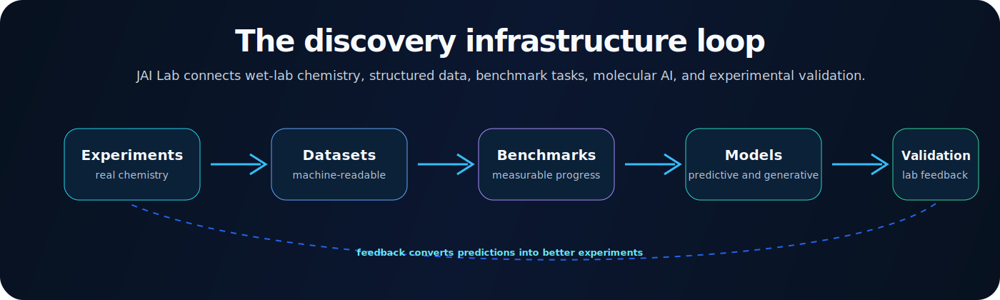
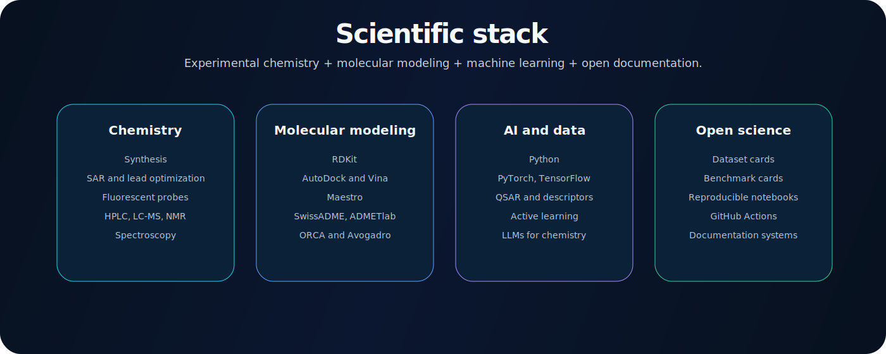
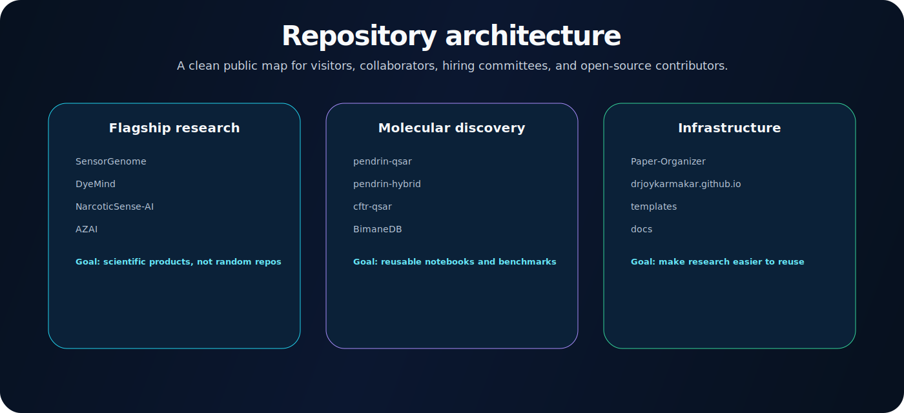
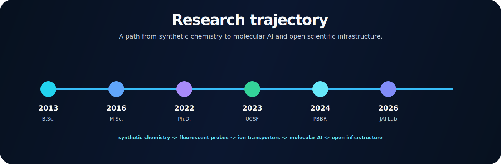

# Joy Karmakar, Ph.D.

### Medicinal chemist building open infrastructure for AI-powered molecular discovery.

**Medicinal chemistry | chemical biology | fluorescent probes | transporter biology | spectroscopy | QSAR | molecular AI | open science**

---

## What I am building

I am building **JAI Lab**, an independent open research initiative for molecular discovery.

The thesis is simple:

> The next leap in molecular AI will come not only from larger models, but from better scientific infrastructure: cleaner datasets, stronger benchmarks, reproducible software, and experiments that machines can actually read.

JAI Lab connects synthetic chemistry, fluorescent probes, transporter biology, analytical chemistry, molecular modeling, machine learning, and open-source scientific software.

---

## Research signal

| Signal | Evidence |
|---|---|
| **Scientific base** | Medicinal chemistry, synthetic organic chemistry, fluorescent probes, chemical biology, ion transporter pharmacology |
| **Research output** | 8 peer-reviewed publications; h-index 6; 75 citations as listed in my June 2026 CV |
| **Independent funding** | UCSF PBBR Postdoctoral Independent Research Award for a xylazine fluorescent sensor project |
| **Translational training** | Harvard Business School Foundry Bootcamp, ACS Postdoc to Faculty Workshop, Sigma Xi Full Member |
| **Open-source direction** | Public GitHub projects spanning sensing, spectroscopy, QSAR, docking, paper organization, and molecular datasets |

---

## Start here

| Area | Repository | What it does |
|---|---|---|
| **Molecular sensing** | [SensorGenome](https://github.com/drjoykarmakar/SensorGenome) | AI platform for molecular sensing datasets, benchmark tasks, active learning, and autonomous sensor discovery |
| **Spectroscopy and analytical chemistry** | [NarcoticSense-AI](https://github.com/drjoykarmakar/NarcoticSense-AI) | Open-source AI platform for spectroscopy, chemometrics, and narcotic sensing research |
| **Xylazine analytics** | [AZAI](https://github.com/drjoykarmakar/AZAI) | AI-driven xylazine analytics and innovation for emerging adulterant detection |
| **Fluorophore data** | [BimaneDB](https://github.com/drjoykarmakar/BimaneDB) | Open bimane fluorescent dye database and preliminary QSAR modeling |
| **Transporter drug discovery** | [pendrin-qsar](https://github.com/drjoykarmakar/pendrin-qsar) / [pendrin-hybrid](https://github.com/drjoykarmakar/pendrin-hybrid) | Ligand-based and structure-based modeling of pendrin inhibitors |
| **CFTR molecular modeling** | [cftr-qsar](https://github.com/drjoykarmakar/cftr-qsar) | QSAR modeling of CFTR potentiators using RDKit and ML |
| **Research tooling** | [Paper-Organizer](https://github.com/drjoykarmakar/Paper-Organizer) | AI-powered research paper organizer for scientific literature workflows |
| **Personal site** | [drjoykarmakar.github.io](https://github.com/drjoykarmakar/drjoykarmakar.github.io) | Personal scientific website and research portfolio |

---

## JAI Lab ecosystem

| Program | Core question | Public artifact |
|---|---|---|
| **SensorGenome** | How do we make molecular sensing experiments machine-readable and benchmarkable? | Dataset schemas, benchmark cards, active-learning workflows |
| **DyeMind** | Can AI accelerate fluorescent probe and fluorophore discovery? | Predictive models, generative design ideas, fluorophore datasets |
| **NarcoticSense AI** | Can spectroscopy and chemometrics provide useful chemical intelligence? | Spectral preprocessing, classification, analysis pipelines |
| **AZAI** | How can molecular sensing support xylazine and emerging adulterant analytics? | Xylazine-centered computational and sensing workflows |
| **Molecular Discovery Suite** | How can QSAR, docking, SAR, and ADMET support transporter-focused drug discovery? | Pendrin, PAT1, CFTR, and related molecular modeling workflows |
| **Open Science Tools** | How do we make research reusable by default? | Templates, dataset cards, benchmark cards, documentation systems |

---

## Scientific foundation

My research training is experimental first, computationally expanding, and infrastructure-focused.

<table>
<tr>
<td width="50%">

### Experimental chemistry

- Multi-step organic synthesis
- Medicinal chemistry and SAR
- Fluorescent probe and sensor design
- Small-molecule modulator discovery
- Ion transporter chemical biology
- HPLC, LC-MS, HRMS, NMR, UV-Vis, fluorescence spectroscopy

</td>
<td width="50%">

### Computational discovery

- RDKit-based molecular descriptors
- QSAR and hybrid modeling
- Docking with AutoDock, Vina, and Maestro
- SwissADME and ADMETlab workflows
- DFT-oriented HOMO-LUMO analysis with ORCA and Avogadro
- AI/ML, deep learning, generative AI, and chemistry LLM evaluation

</td>
</tr>
</table>

---

## Selected research highlights

### Ion transporter drug discovery

At UCSF, I worked on small-molecule modulators of ion transporters including Pendrin, PAT1, and CFTR-relevant chemistry. My postdoctoral research included SAR-driven optimization of Pendrin inhibitors and PAT1 inhibitors, with sub-micromolar to low-micromolar leads and in vivo validation in collaborative biological models.

### Fluorescent probes and chemical sensing

My doctoral research focused on novel bimane derivatives, luminescent chemical tools, and sensing applications. This foundation now informs **DyeMind**, **BimaneDB**, and molecular sensing projects aimed at turning fluorescent probe discovery into a more data-rich and AI-ready field.

### Xylazine and emerging adulterant analytics

Through the UCSF PBBR award project and the AZAI/NarcoticSense AI direction, I am exploring how fluorescent probes, spectroscopy, chemometrics, and molecular AI can support chemical intelligence for xylazine and related emerging adulterants.

### Open molecular infrastructure

I am building public tools that make chemistry easier to reproduce: curated molecular datasets, benchmark templates, QSAR notebooks, spectroscopy pipelines, and repository standards that make scientific software more useful to other researchers.

---

## Publications and scientific output

**Peer-reviewed publications:** 8  
**Google Scholar metrics listed in CV:** h-index 6, 75 citations  
**Selected journals:** European Journal of Medicinal Chemistry, RSC Medicinal Chemistry, Chemical Communications, Frontiers in Chemistry, Synlett, Israel Journal of Chemistry, Inorganica Chimica Acta

Selected publications:

1. **High potency 3-carboxy-2-methylbenzofuran pendrin inhibitors as novel diuretics.** *European Journal of Medicinal Chemistry* (2024).
2. **Selective isoxazolopyrimidine PAT1 (SLC26A6) inhibitors for therapy of intestinal disorders.** *RSC Medicinal Chemistry* (2023).
3. **A dipodal bimane-ditriazole-diCu(II) complex serves as ultrasensitive water sensor.** *Chemical Communications* (2022).
4. **Highly sensitive water detection through reversible fluorescence changes in a syn-bimane based boronic acid derivative.** *Frontiers in Chemistry* (2022).

For the full list, see [Google Scholar](https://scholar.google.com/citations?user=uaIKU0oAAAAJ).

---

## Research manifesto

| Principle | Meaning |
|---|---|
| **Better data beats bigger claims** | Molecular AI is only as useful as the experimental data behind it. |
| **Benchmarks create accountability** | Progress should be measured through transparent tasks, not vague demos. |
| **Experiments should be machine-readable** | Protocols, conditions, controls, uncertainty, and outcomes belong in structured datasets. |
| **Models must return to chemistry** | Predictions need experimental context, synthetic feasibility, and validation. |
| **Open infrastructure compounds** | Reusable datasets, templates, and software help the entire field move faster. |

---

## Repository architecture

I organize repositories as scientific products, not storage folders. A strong JAI Lab repository should include:

- a clear scientific question
- a reproducible environment
- examples that run quickly
- dataset or benchmark cards when relevant
- citation metadata
- roadmap and known limitations
- contribution instructions

---

## Current roadmap

- [ ] Convert SensorGenome into the flagship public standard for molecular sensing datasets and benchmark cards
- [ ] Release polished dataset-card and benchmark-card templates for molecular AI projects
- [ ] Standardize repository READMEs across SensorGenome, AZAI, NarcoticSense AI, BimaneDB, pendrin, and CFTR projects
- [ ] Expand DyeMind into a dedicated fluorescent-probe AI workspace
- [ ] Add reproducible notebooks for QSAR, docking, spectroscopy, and active-learning workflows
- [ ] Create a documentation site for JAI Lab projects, tutorials, and research notes
- [ ] Link publications to code, datasets, and reproducibility artifacts whenever possible

---

## Research timeline

---

## Technical stack

**Chemistry:** ChemDraw, MestreNova, Mercury, ACD/NMR, HPLC, LC-MS, HRMS, NMR, UV-Vis, fluorescence spectroscopy  
**Cheminformatics and modeling:** RDKit, AutoDock, AutoDock Vina, Maestro, SwissADME, ADMETlab, ORCA, Avogadro  
**AI and data:** Python, PyTorch, TensorFlow, scikit-learn, pandas, NumPy, QSAR, molecular descriptors, active learning, uncertainty-aware modeling  
**Open science:** GitHub Actions, Docker, reproducible notebooks, dataset cards, benchmark cards, documentation systems

---

## GitHub activity

---

## Collaboration

I am interested in collaborations across molecular sensing, fluorescent probes, transporter chemical biology, medicinal chemistry, spectroscopy, analytical chemistry, AI/ML for chemistry, drug discovery, open datasets, benchmark development, and reproducible scientific software.

Connect through [joykarmakar.com](https://www.joykarmakar.com), [LinkedIn](https://www.linkedin.com/in/joykarmakarchem), [Bluesky](https://bsky.app/profile/joykarmakar.com), or GitHub.

---

### Building open infrastructure for molecular discovery.

