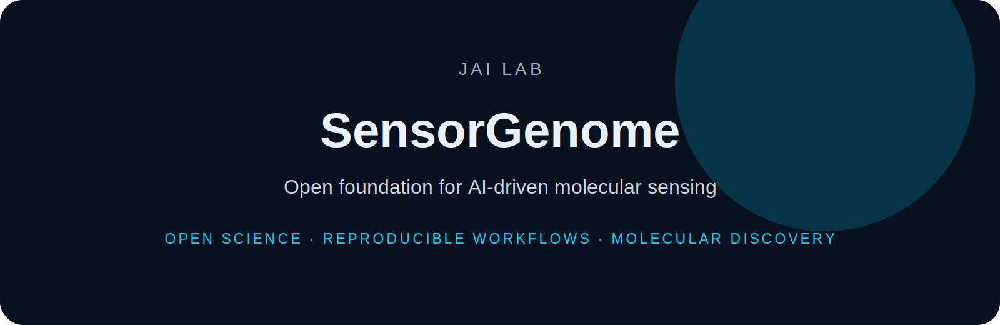

<p align="center">
  
</p>

<h1 align="center">SensorGenome</h1>

<p align="center">
  <b>Open foundation for AI-driven molecular sensing</b>
</p>

<p align="center">
  
  
  
</p>

---

SensorGenome is an open foundation for AI-driven molecular sensing: datasets, benchmarks, models, and active-learning workflows for discovering and evaluating chemical sensors.

The project treats the **experiment** as the atomic unit, not only the molecule: analyte → recognition mechanism → sensor molecule → assay protocol → signal → selectivity → uncertainty → next experiment.

## Initial scientific wedge

- fluorescent small-molecule probe response
- bimane-derived probes
- xylazine/adulterant sensing workflows
- analyte/interferent selectivity
- raw spectra and response curves
- standardized assay metadata
- uncertainty-aware ML baselines
- active-learning experiment selection

## v0.1.0-alpha milestone

SensorGenome-Bench v0.1 establishes a probe-response benchmark with 25 curated seed sensor examples, schema validation, a baseline model, and active-learning demo.


---

## Installation

```bash
git clone https://github.com/DrJoyKarmakar/SensorGenome.git
cd SensorGenome
```

Add project-specific installation instructions here.

---

## Repository standard

This repository follows the **JAI Lab** documentation system:

- clear scientific motivation
- reproducible setup
- documented data/schema assumptions
- benchmark-ready workflows
- citation and licensing information

---

## Citation

```bibtex
@software{jai_lab_sensorgenome,
  author = {Karmakar, Joy},
  title = {SensorGenome},
  year = {2026},
  url = {https://github.com/DrJoyKarmakar/SensorGenome}
}
```

---

## License

MIT for code unless otherwise specified. Dataset licensing should be defined separately when applicable.
